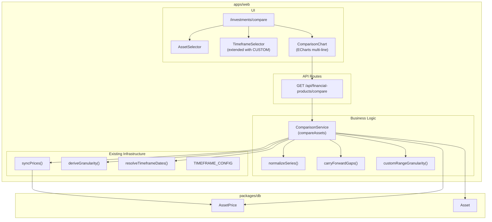

# Design Document

## Overview

The Asset Comparison feature enables users to select 2–5 assets and compare their percentage performance on a single ECharts line chart. All price series are normalized to 0% at a common start date, so absolute price differences are irrelevant and relative performance is immediately visible. The feature reuses the existing price synchronization pipeline (`syncPrices`), granularity derivation (`deriveGranularity`, `TIMEFRAME_CONFIG`), and date resolution (`resolveTimeframeDates`) infrastructure. No new database tables are required — all data is derived from the existing `asset_prices` table.

Additionally, the `TimeframeSelector` component gains a custom date range picker (CUSTOM timeframe) that applies both to the new comparison page and the existing single-asset Portfolio page.

## Architecture



## Components and Interfaces

### API Route: GET /api/financial-products/compare

Accepts a list of 2–5 asset IDs and a timeframe (preset or custom date range). Orchestrates price sync, computes the effective common start date, normalizes each series, applies carry-forward for missing data points, and returns the multi-series comparison payload.

### Service: ComparisonService (`compareAssets`)

Pure orchestration function that:
1. Validates input (asset count, duplicates, timeframe)
2. Resolves the date window (preset via `resolveTimeframeDates` or custom dates directly)
3. Derives granularity per asset via `deriveGranularity` (or `customRangeGranularity` for CUSTOM)
4. Invokes `syncPrices` for each asset independently (collecting failures)
5. If any sync failed, aborts with error identifying the failed assets
6. Queries `asset_prices` for each asset within the window and granularity
7. Computes the effective common start date (latest first-available date across assets)
8. Validates minimum 2 data points per asset after common start
9. Normalizes each series using the formula
10. Applies carry-forward alignment for chart display
11. Returns the structured comparison response

### Function: `normalizeSeries`

Pure function that transforms a price array into percentage change values:
```typescript
function normalizeSeries(
  prices: { timestamp: Date; price: number }[],
  firstPrice: number
): { timestamp: string; value: number }[]
```
Formula: `round(((price / firstPrice) - 1) * 100, 2)`

### Function: `carryForwardGaps`

Takes multiple normalized series with potentially different timestamps and produces aligned series where missing timestamps are filled with the last known value:
```typescript
function carryForwardGaps(
  series: Map<number, { timestamp: string; value: number }[]>
): Map<number, { timestamp: string; value: number }[]>
```

### Function: `customRangeGranularity`

Maps a custom date range span (in days) to the appropriate granularity and interval:
```typescript
function customRangeGranularity(
  startDate: Date,
  endDate: Date,
  priceFrequency: "DAILY" | "INTRADAY"
): { granularity: GranularityValue; interval: YahooInterval }
```

Thresholds:
- ≤7 days → same as 1W (HOURLY / "1h")
- ≤31 days → same as 1M (DAILY / "1d")
- ≤365 days → same as 1Y (DAILY / "1d")
- \>365 days → same as 5Y (WEEKLY / "1wk")

Applies the existing DAILY fallback: if priceFrequency is "DAILY" and derived granularity is FIFTEEN_MIN or HOURLY, fall back to DAILY / "1d".

### UI Component: AssetSelector

Client component allowing the user to pick 2–5 assets from the tracked asset list. Uses the existing `AssetSearch` component pattern. Prevents duplicates and enforces min/max.

### UI Component: TimeframeSelector (extended)

The existing `TimeframeSelector` is extended with:
- A "Custom" button that opens a date range picker (start date + end date inputs)
- When custom is active, all preset buttons appear inactive
- Selecting a preset clears the custom range
- Validation: start date must be before end date

This extension applies to both the comparison page and the existing `FinancialProductsView` Portfolio page.

### UI Component: ComparisonChart

ECharts multi-line chart with:
- Shared percentage y-axis (formatted as `X.XX%`)
- Shared time x-axis
- 2–5 line series with distinct colors
- Legend showing asset name + period return (last normalized value)
- Loading state while fetching
- Responsive resize handling

### Color Palette

A fixed palette of 5 visually distinct colors for the chart lines:
```typescript
const COMPARISON_COLORS = [
  "#2563eb", // blue
  "#dc2626", // red
  "#16a34a", // green
  "#9333ea", // purple
  "#ea580c", // orange
];
```

## Data Models

No new database models are required. The feature reads from existing tables:

- **Asset** — to resolve asset metadata and provider mappings
- **AssetPrice** — to read price data filtered by asset_id, granularity, and timestamp range
- **AssetPriceSyncRange** — used internally by `syncPrices` to determine coverage gaps

### Query Pattern

For each asset in the comparison:
```sql
SELECT timestamp, price
FROM asset_prices
WHERE asset_id = ?
  AND granularity = ?
  AND timestamp >= ?
  AND timestamp <= ?
ORDER BY timestamp ASC
```

## API Design

### GET /api/financial-products/compare

**Query Parameters (Zod Schema):**

```typescript
const compareQuerySchema = z.object({
  assetIds: z.string().transform((s) => s.split(",").map(Number)),
  timeframe: z.enum(["1W", "1M", "3M", "6M", "1Y", "5Y", "ALL"]).optional(),
  startDate: z.coerce.date().optional(),
  endDate: z.coerce.date().optional(),
}).refine(
  (data) => data.timeframe || (data.startDate && data.endDate),
  { message: "Either timeframe or both startDate and endDate must be provided" }
).refine(
  (data) => !data.startDate || !data.endDate || data.startDate < data.endDate,
  { message: "startDate must be before endDate" }
).refine(
  (data) => {
    const ids = data.assetIds;
    return ids.length >= 2 && ids.length <= 5 && new Set(ids).size === ids.length;
  },
  { message: "Must provide 2-5 unique asset IDs" }
);
```

**Logic Flow:**

1. Validate query params → 400 on Zod error
2. Load all assets from DB → 404 if any asset not found
3. Resolve date window:
   - If `timeframe` provided: use `resolveTimeframeDates(timeframe)`
   - If `startDate` + `endDate` provided: use directly (CUSTOM mode)
4. For each asset, derive granularity:
   - Preset: `deriveGranularity(timeframe, asset.price_frequency)`
   - Custom: `customRangeGranularity(startDate, endDate, asset.price_frequency)`
5. Sync prices for all assets in parallel (`Promise.allSettled`)
6. If any sync failed → 502 with failed asset details
7. Query `asset_prices` for each asset (granularity + date range)
8. If any asset has 0 rows → error (no data)
9. Compute effective common start date = max of each asset's first timestamp
10. If any asset has < 2 data points after common start → error with details
11. For each asset, extract firstPrice at common start date
12. If any firstPrice is 0 or null → error (cannot normalize)
13. Normalize each series
14. Apply carry-forward alignment
15. Return response

**Response:**

```typescript
{
  series: Array<{
    assetId: number;
    assetName: string;
    ticker: string;
    color: string;
    periodReturn: number;  // last normalized value (total % change)
    dataPoints: Array<{
      timestamp: string;   // ISO 8601
      value: number;       // normalized % change, 2 decimals
    }>;
  }>;
  effectiveStartDate: string;  // ISO 8601
  timeframe: string;           // "1W" | "1M" | ... | "CUSTOM"
}
```

**Error Responses:**

| Scenario | Status | Body |
|----------|--------|------|
| Invalid params (Zod) | 400 | `{ error: "Invalid request data", details }` |
| Asset not found | 404 | `{ error: "Asset not found", assetId }` |
| Sync failed | 502 | `{ error: "Price sync failed", failedAssets: [{ assetId, ticker, reason }] }` |
| No data after sync | 422 | `{ error: "No price data available", assets: [{ assetId, ticker }] }` |
| Insufficient data (< 2 points) | 422 | `{ error: "Insufficient data points", assets: [{ assetId, ticker, dataPoints }] }` |
| Cannot normalize (firstPrice=0) | 422 | `{ error: "Cannot normalize: zero price at start date", assets: [{ assetId, ticker }] }` |
| Internal error | 500 | `{ error: "Internal server error" }` |

## Correctness Properties

*A property is a characteristic or behavior that should hold true across all valid executions of a system — essentially, a formal statement about what the system should do. Properties serve as the bridge between human-readable specifications and machine-verifiable correctness guarantees.*

### Property 1: Asset count validation bounds

*For any* array of asset IDs, the comparison validation SHALL accept it if and only if the array length is between 2 and 5 inclusive. Arrays with fewer than 2 or more than 5 elements SHALL be rejected.

**Validates: Requirements 1.1, 1.2, 1.3, 1.4**

### Property 2: Duplicate asset prevention

*For any* array of asset IDs containing at least one duplicate value, the comparison validation SHALL reject the input regardless of the array length.

**Validates: Requirements 1.5**

### Property 3: Invalid timeframe rejection

*For any* string value that is not one of the supported preset timeframes (1W, 1M, 3M, 6M, 1Y, 5Y, ALL) and is not a valid custom date range, the comparison service SHALL reject the request.

**Validates: Requirements 2.4**

### Property 4: Custom date range validation

*For any* pair of dates where startDate >= endDate, the comparison validation SHALL reject the input. *For any* pair of dates where startDate < endDate, the dates SHALL be accepted and used directly as the timeframe window.

**Validates: Requirements 2.7, 2.8**

### Property 5: Effective common start date computation

*For any* set of 2–5 assets where each asset has a first available price date within the resolved timeframe window, the effective common start date SHALL equal the maximum (latest) of all those first available dates. When all first dates are at or before the timeframe window start, the effective common start date SHALL equal the window start.

**Validates: Requirements 3.1, 3.2**

### Property 6: Insufficient data detection

*For any* set of assets where at least one asset has fewer than 2 data points at its display granularity after the effective common start date, the comparison service SHALL return an error identifying which asset(s) have fewer than 2 data points.

**Validates: Requirements 3.4, 3.5, 4.4**

### Property 7: Sync failure identification

*For any* set of assets being synchronized where a non-empty subset of sync operations fail, the comparison service SHALL abort and return an error that contains exactly the set of failed asset identifiers along with failure reasons.

**Validates: Requirements 4.2, 4.3**

### Property 8: Normalization formula correctness

*For any* price series `[p0, p1, ..., pN]` where `p0 > 0` is the price at the effective common start date, the normalized series SHALL be `[0.00, round(((p1/p0) - 1) * 100, 2), ..., round(((pN/p0) - 1) * 100, 2)]`. The first value SHALL always be exactly `0.00`.

**Validates: Requirements 5.1, 5.2**

### Property 9: Carry-forward for missing data points

*For any* normalized series with gaps (timestamps present in one asset but not another), the carry-forward function SHALL fill each gap with the most recent known value from that series. No gaps SHALL remain in the output, and no value SHALL be invented that wasn't the last known value.

**Validates: Requirements 5.4, 6.5**

### Property 10: Distinct color assignment

*For any* set of 2–5 assets in a comparison, the color assignment SHALL produce all distinct color values — no two assets SHALL share the same color.

**Validates: Requirements 6.2**

### Property 11: Custom range granularity derivation

*For any* custom date range, the derived granularity SHALL follow the span thresholds: span ≤7 days maps to HOURLY/"1h", span ≤31 days maps to DAILY/"1d", span ≤365 days maps to DAILY/"1d", span >365 days maps to WEEKLY/"1wk". The DAILY fallback for DAILY-frequency assets SHALL still apply when the derived granularity would be sub-daily.

**Validates: Requirements 7.5**

### Property 12: Independent per-asset granularity

*For any* comparison involving assets with differing `price_frequency` values, each asset's display granularity SHALL be derived independently based on its own price_frequency and the selected timeframe. An INTRADAY asset and a DAILY asset in the same comparison MAY have different granularities.

**Validates: Requirements 7.4**

## Error Handling

| Scenario | HTTP Status | Response |
|----------|-------------|----------|
| Invalid query params (Zod validation) | 400 | `{ error: "Invalid request data", details }` |
| Asset ID not found in database | 404 | `{ error: "Asset not found", assetId }` |
| No Yahoo Finance mapping for asset | 404 | `{ error: "No provider mapping for asset", assetId }` |
| Price sync fails (network/API error) | 502 | `{ error: "Price sync failed", failedAssets }` |
| No price data after sync | 422 | `{ error: "No price data available", assets }` |
| Fewer than 2 data points after common start | 422 | `{ error: "Insufficient data points", assets }` |
| First price is zero (cannot normalize) | 422 | `{ error: "Cannot normalize: zero price at start date", assets }` |
| Internal server error | 500 | `{ error: "Internal server error" }` |

The API always returns a JSON error body. The client displays user-friendly error messages based on the error type. The comparison chart shows a loading state during fetch and an error state with a retry button on failure.

## Testing Strategy

### Unit Tests

- **Validation**: Specific examples of valid/invalid inputs (asset count, duplicate IDs, timeframe values, date ranges)
- **Normalization**: Known price series → expected normalized output
- **Carry-forward**: Specific sparse series → expected filled series
- **Custom granularity**: Specific date spans → expected granularity
- **Effective common start date**: Known first-available dates → expected result
- **Error cases**: Zero first price, missing assets, empty series after sync

### Property Tests

Property tests use `fast-check` with minimum 100 iterations per property, consistent with the existing test patterns in the codebase (e.g., `computeMissingRanges.property.test.ts`).

Each property test is tagged with a comment referencing its design property:
- **Feature: asset-comparison, Property 1: Asset count validation bounds**
- **Feature: asset-comparison, Property 2: Duplicate asset prevention**
- **Feature: asset-comparison, Property 3: Invalid timeframe rejection**
- **Feature: asset-comparison, Property 4: Custom date range validation**
- **Feature: asset-comparison, Property 5: Effective common start date computation**
- **Feature: asset-comparison, Property 6: Insufficient data detection**
- **Feature: asset-comparison, Property 7: Sync failure identification**
- **Feature: asset-comparison, Property 8: Normalization formula correctness**
- **Feature: asset-comparison, Property 9: Carry-forward for missing data points**
- **Feature: asset-comparison, Property 10: Distinct color assignment**
- **Feature: asset-comparison, Property 11: Custom range granularity derivation**
- **Feature: asset-comparison, Property 12: Independent per-asset granularity**

### Integration Tests

- End-to-end API route with real DB (2 assets, preset timeframe)
- Custom date range flow through the API
- Sync failure handling (mocked Yahoo Finance errors)
- TimeframeSelector with custom date range on Portfolio page (regression)

## File Structure

```
apps/web/app/
├── api/
│   └── financial-products/
│       └── compare/
│           └── route.ts                        # GET /api/financial-products/compare
├── investments/
│   └── compare/
│       └── page.tsx                            # Server component for comparison page
└── _lib/
    └── financialProducts/
        ├── compareAssets.ts                    # ComparisonService orchestration
        ├── normalizeSeries.ts                  # Normalization formula
        ├── carryForwardGaps.ts                 # Gap-filling with carry-forward
        └── customRangeGranularity.ts           # Custom date span → granularity

apps/web/components/
├── financial-products/
│   ├── TimeframeSelector.tsx                   # Extended with custom date range
│   ├── AssetSelector.tsx                       # Multi-asset selector (2-5)
│   └── ComparisonChart.tsx                     # ECharts multi-line % chart
```
