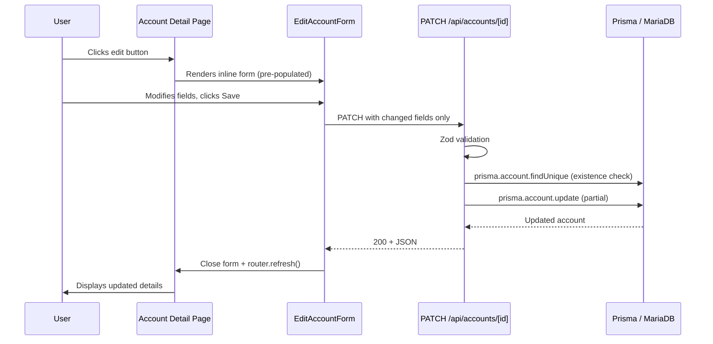

# Design Document: Edit Account Details

## Overview

This feature adds the ability to edit account metadata (name, icon, active status) from the account detail page. It follows the existing patterns established by the expense editing workflow: a PATCH API endpoint with Zod validation, and a client-side form component using local state and `fetch`.

The account balance is **not** editable since it is derived from completed financial items. No snapshot recalculation is needed because name, icon, and active status do not affect balance calculations.

## Architecture



## Components and Interfaces

### API Layer

**File:** `apps/web/app/api/accounts/[id]/route.ts`

Add a `PATCH` handler to the existing route file (which already has `GET`). Follow the project's API route pattern:

```typescript
// Zod schema for partial account updates
const updateAccountSchema = z.object({
  name: z.string().min(1).optional(),
  icon: z.string().nullable().optional(),
  active: z.boolean().optional(),
}).refine(
  (data) => data.name === undefined || data.name.trim().length > 0,
  { message: "Name cannot be empty or whitespace-only", path: ["name"] }
);
```

The PATCH handler:
1. Parses and validates `id` from params (400 if invalid)
2. Parses request body with Zod schema (400 on ZodError)
3. Checks account existence via `findUnique` (404 if not found)
4. Calls `prisma.account.update` with only the provided fields
5. Returns the updated account as JSON with status 200
6. Catches all other errors → 500

Update the `OPTIONS` handler to include PATCH in the Allow header.

### Form Component

**File:** `apps/web/components/accounts/EditAccountForm.tsx`

A `'use client'` component following the `EditExpenseForm` pattern:

```typescript
type Props = {
  account: {
    id: number;
    name: string;
    icon: string | null;
    active: boolean;
  };
  onClose: () => void;
};
```

- Local `useState` for: `name`, `icon`, `active`, `saving`, `error`
- Pre-populates from `account` prop
- Client-side validation: rejects whitespace-only name before fetch
- Sends PATCH with only changed fields (compares current state to original props)
- On success: calls `onClose()` and `router.refresh()`
- On failure: displays error message, re-enables form
- All inputs and buttons disabled while `saving === true`
- Uses the existing `IconPicker` component for icon selection
- Uses shadcn `Switch` for active toggle

### Account Detail Page Integration

**File:** `apps/web/app/accounts/[id]/page.tsx`

The page itself is a server component and cannot hold toggle state. A small wrapper client component (`AccountHeader`) will manage the edit visibility:

**File:** `apps/web/components/accounts/AccountHeader.tsx`

```typescript
type Props = {
  account: {
    id: number;
    name: string;
    icon: string | null;
    balance: string;
    createdAtIso: string;
    active: boolean;
  };
};
```

- Renders `AccountSummary` plus an edit button (Pencil icon from lucide-react)
- Toggles `editing` state on click
- When `editing === true`, renders `EditAccountForm` inline below the summary
- Passes `onClose` to collapse the form

## Data Models

No schema changes needed. The existing `Account` model already has all required fields:

```prisma
model Account {
  id         Int       @id @default(autoincrement())
  name       String
  icon       String?
  balance    Decimal   @db.Decimal(18, 2)
  created_at DateTime  @default(now())
  active     Boolean   @default(true)
  // ... relations
}
```

The PATCH endpoint updates only `name`, `icon`, and `active`. The `balance` and `created_at` fields are never modified by this endpoint.

## Correctness Properties

*A property is a characteristic or behavior that should hold true across all valid executions of a system — essentially, a formal statement about what the system should do. Properties serve as the bridge between human-readable specifications and machine-verifiable correctness guarantees.*

### Property 1: Partial update preserves untouched fields

*For any* existing account and *for any* subset of editable fields (name, icon, active) provided in a PATCH request, the fields NOT included in the request body SHALL remain unchanged in the database after the update.

**Validates: Requirements 1.8**

### Property 2: Validation rejects invalid field types

*For any* PATCH request body where a provided field has an incorrect type (name is not a string, icon is not a string or null, active is not a boolean), the Account_API SHALL return a 400 status and the account record SHALL remain unchanged.

**Validates: Requirements 1.4, 1.6, 1.7**

### Property 3: Whitespace-only names are rejected

*For any* string composed entirely of whitespace characters (spaces, tabs, newlines), when provided as the `name` field in a PATCH request, the Account_API SHALL return a 400 status and the account record SHALL remain unchanged.

**Validates: Requirements 1.5, 3.1, 3.2**

### Property 4: Only changed fields are sent in PATCH body

*For any* initial account state and *for any* set of form modifications, when the user saves the form, the request body SHALL contain only the fields whose values differ from the original account state.

**Validates: Requirements 2.2**

## Error Handling

| Scenario | Layer | Behavior |
|----------|-------|----------|
| Invalid ID (non-numeric) | API | 400 with `{ error: "ID must be a number" }` |
| Account not found | API | 404 with `{ error: "Account not found" }` |
| Zod validation failure | API | 400 with `{ error: "Invalid request data", details: ZodError }` |
| Database error | API | 500 with `{ error: "Failed to update account" }` |
| Empty/whitespace name | Client | Prevent submission, show inline error |
| Network failure | Client | Show error message, re-enable form |
| Non-200 API response | Client | Show error message from response body, re-enable form |

## Testing Strategy

### Unit Tests
- API route: test each error path (invalid ID, not found, validation failure)
- API route: test successful partial updates with various field combinations
- Form component: test pre-population, cancel behavior, disabled state during save

### Property-Based Tests (Vitest + fast-check)
- **Property 1**: Generate random subsets of `{name, icon, active}` with valid values, apply PATCH, verify untouched fields preserved
- **Property 2**: Generate random invalid payloads (wrong types), verify 400 rejection
- **Property 3**: Generate random whitespace-only strings, verify rejection at API level
- **Property 4**: Generate random account states and modifications, verify request body contains only diffs

**PBT Configuration:**
- Library: `fast-check` with Vitest
- Minimum 100 iterations per property
- Tag format: `Feature: edit-account-details, Property N: <title>`
