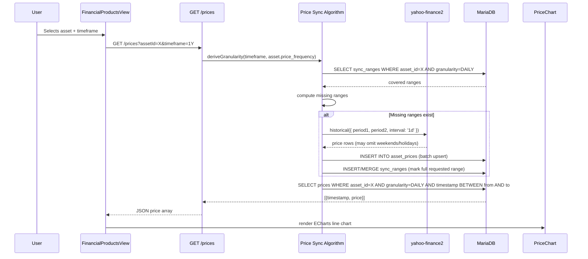
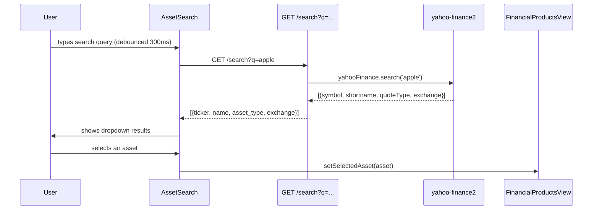

# Design Document: Financial Product Data

## Overview

This feature adds a dedicated `/financial-products` page to Precision Ledger that lets the user search for financial assets (ETFs, funds, stocks, ETPs, crypto) via Yahoo Finance, track specific assets in the local database, and view historical price charts for any asset across multiple timeframes. Price data is fetched on-demand from Yahoo Finance (`yahoo-finance2`) and cached locally in MariaDB to avoid redundant API calls. The sync algorithm tracks downloaded ranges and only fetches missing data, making chart loads fast after the first request.

The feature introduces three new Prisma models (`Asset`, `AssetPrice`, `AssetPriceSyncRange`) and five API routes, a server-rendered page component, and four client components following the project's established React + ECharts patterns.

> **Note for future work:** Background cron sync (to keep tracked assets up-to-date without user interaction) is out of scope for this iteration. A `TODO` comment should be added to the README describing a future cron job at `/api/internal/jobs/sync-financial-products` that incrementally refreshes all tracked assets.

## Architecture

```mermaid
graph TD
    A["/financial-products page (RSC)"] --> B[FinancialProductsView client component]
    B --> C[AssetSearch]
    B --> D[TrackedAssetList]
    B --> E[TimeframeSelector]
    B --> F[PriceChart]

    C -->|GET /api/financial-products/search?q=...| G[Search API]
    G -->|yahooFinance.search| H[Yahoo Finance]

    D -->|GET /api/financial-products/assets| I[Assets API]
    I --> J[(MariaDB: assets)]

    B -->|GET /api/financial-products/prices?assetId=X&timeframe=Y| K[Prices API]
    K --> L[Price Sync Algorithm]
    L -->|query| M[(MariaDB: asset_price_sync_ranges)]
    L -->|fetch missing ranges| H
    L -->|INSERT| N[(MariaDB: asset_prices)]
    L -->|query| N
    K --> F

    B -->|POST /api/financial-products/assets| I
    B -->|DELETE /api/financial-products/assets/[id]| I
```

## Sequence Diagrams

### Chart Load Flow



### Asset Search Flow




## Components and Interfaces

### API Layer

Five route files live under `apps/web/app/api/financial-products/`. All follow the project's standard pattern: `export const dynamic = "force-dynamic"`, Zod validation before any DB access, `ZodError` → 400, unexpected errors → 500, and an `OPTIONS` handler with the correct `Allow` header.

---

**File:** `apps/web/app/api/financial-products/search/route.ts`

```typescript
// GET /api/financial-products/search?q=<query>
// Proxies to yahoo-finance2 and returns a normalised result list.
// No DB writes — purely a search passthrough.

const searchQuerySchema = z.object({
  q: z.string().min(1).max(200),
});

export async function GET(request: Request) {
  const { searchParams } = new URL(request.url);
  const parsed = searchQuerySchema.parse({ q: searchParams.get("q") });
  const results = await yahooFinance.search(parsed.q);
  // Map to AssetSearchResult, return 200
}
```

Response type:

```typescript
type AssetSearchResult = {
  ticker: string;       // Yahoo symbol, e.g. "VWRL.L"
  name: string;         // shortname from Yahoo
  asset_type: AssetType;// derived from quoteType
  exchange: string;     // e.g. "LSE"
};
```

---

**File:** `apps/web/app/api/financial-products/assets/route.ts`

```typescript
// GET  /api/financial-products/assets      → list all tracked assets
// POST /api/financial-products/assets      → start tracking a new asset

const createAssetSchema = z.object({
  ticker:          z.string().min(1),
  isin:            z.string().nullable().optional(),
  name:            z.string().min(1),
  asset_type:      z.enum(["FUND", "ETF", "ETP", "STOCK", "CRYPTO"]),
  price_frequency: z.enum(["DAILY", "INTRADAY"]),
  currency:        z.string().length(3),   // ISO 4217, e.g. "USD"
});
```

- `GET` returns `Asset[]` ordered by `name ASC`.
- `POST` upserts by `ticker` (a second track attempt on the same ticker is idempotent — returns the existing record with 200).

---

**File:** `apps/web/app/api/financial-products/assets/[id]/route.ts`

```typescript
// DELETE /api/financial-products/assets/[id]
// Removes the asset and cascades: asset_prices and asset_price_sync_ranges
// are deleted via Prisma cascade (onDelete: Cascade on both relations).
// Returns 204 No Content on success, 404 if not found.
```

---

**File:** `apps/web/app/api/financial-products/prices/route.ts`

```typescript
// GET /api/financial-products/prices?assetId=<id>&timeframe=<timeframe>
// Orchestrates the price sync algorithm, then returns the requested slice.

const pricesQuerySchema = z.object({
  assetId:   z.coerce.number().int().positive(),
  timeframe: z.enum(["TODAY", "1W", "1M", "3M", "6M", "1Y", "5Y", "ALL"]),
});
```

Handler steps:
1. Parse + validate query params (400 on failure).
2. Load `Asset` from DB (404 if not found).
3. Call `deriveGranularity(timeframe, asset.price_frequency)` → `{ granularity, interval, from, to }`.
4. Call `syncPrices(asset, granularity, interval, from, to)` — see Price Sync Algorithm below.
5. Query `asset_prices` for `asset_id`, `granularity`, `timestamp BETWEEN from AND to`, ordered by `timestamp ASC`.
6. Return `PricePoint[]`.

Response type:

```typescript
type PricePoint = {
  timestamp: string;  // ISO 8601
  price: number;
};
```

---

**File:** `apps/web/app/api/_lib/financialProducts/priceSyncAlgorithm.ts`

Server-side library (not a route handler). Exports:

```typescript
// Maps a user-facing timeframe + asset frequency to DB granularity + Yahoo interval + date range.
function deriveGranularity(
  timeframe: Timeframe,
  priceFrequency: PriceFrequency
): { granularity: Granularity; interval: YahooInterval; from: Date; to: Date }

// Finds gaps between DB-covered sync ranges and the requested [from, to] window,
// fetches only the missing ranges from Yahoo, upserts prices, and merges sync range records.
async function syncPrices(
  asset: Asset,
  granularity: Granularity,
  interval: YahooInterval,
  from: Date,
  to: Date
): Promise<void>

// Pure function: given a list of covered SyncRange intervals and a [from, to] window,
// returns the list of gaps that need fetching.
function computeMissingRanges(
  covered: Array<{ from: Date; to: Date }>,
  from: Date,
  to: Date
): Array<{ from: Date; to: Date }>

// Merges a newly synced range into the existing sync range records for an asset+granularity,
// collapsing any overlapping or adjacent intervals into a single record.
async function mergeSyncRange(
  assetId: number,
  granularity: Granularity,
  from: Date,
  to: Date
): Promise<void>
```

---

### Client Components

**File:** `apps/web/app/financial-products/page.tsx`

Async RSC. Fetches the tracked assets list server-side and passes it as a prop to `FinancialProductsView`.

---

**File:** `apps/web/components/financial-products/FinancialProductsView.tsx`

`'use client'`. Top-level orchestrator. Holds the shared selection state:

```typescript
type Props = {
  initialAssets: Asset[];
};

// State:
// selectedAsset: Asset | null
// timeframe: Timeframe  (default "1M")
// trackedAssets: Asset[]
```

Renders `AssetSearch`, `TrackedAssetList`, `TimeframeSelector`, and `PriceChart` in a layout grid.

---

**File:** `apps/web/components/financial-products/AssetSearch.tsx`

`'use client'`. Debounced search input (300 ms) that calls `GET /api/financial-products/search?q=...` and renders a dropdown list of `AssetSearchResult`. Selecting an untracked result calls `POST /api/financial-products/assets` to start tracking it, then calls `onAssetAdded(asset)` to update the parent state.

```typescript
type Props = {
  onAssetAdded: (asset: Asset) => void;
};
```

---

**File:** `apps/web/components/financial-products/TrackedAssetList.tsx`

`'use client'`. Displays the list of tracked assets as a selectable list. Clicking an asset fires `onSelect(asset)`. Each row has a delete button that calls `DELETE /api/financial-products/assets/[id]` and fires `onDeleted(id)`.

```typescript
type Props = {
  assets: Asset[];
  selectedAssetId: number | null;
  onSelect: (asset: Asset) => void;
  onDeleted: (assetId: number) => void;
};
```

---

**File:** `apps/web/components/financial-products/TimeframeSelector.tsx`

`'use client'`. Renders eight buttons: Today, 1W, 1M, 3M, 6M, 1Y, 5Y, All. Highlights the active selection. Pure presentational — no data fetching.

```typescript
type Props = {
  value: Timeframe;
  onChange: (t: Timeframe) => void;
};
```

---

**File:** `apps/web/components/financial-products/PriceChart.tsx`

`'use client'`. Fetches `GET /api/financial-products/prices?assetId=X&timeframe=Y` whenever `assetId` or `timeframe` changes. Renders an ECharts line chart using `useRef` + `echarts.init()` + `useEffect`, following the exact same pattern as `MetricsBalanceLinesChart`. Handles loading, error, and empty-data states.

```typescript
type Props = {
  asset: Asset | null;
  timeframe: Timeframe;
};
```

ECharts option shape:

```typescript
{
  tooltip: { trigger: "axis" },
  grid: { left: 20, right: 20, top: 32, bottom: 20, containLabel: true },
  xAxis: { type: "time" },
  yAxis: { type: "value", axisLabel: { formatter: formatCurrency } },
  series: [{
    type: "line",
    smooth: false,
    showSymbol: false,
    lineStyle: { width: 2 },
    data: pricePoints.map(p => [p.timestamp, p.price]),
  }],
}
```

---

## Data Models

### Prisma Schema Additions

Add the following to `packages/db/prisma/schema.prisma`:

```prisma
// ─── Enums ────────────────────────────────────────────────────────────────────

enum AssetType {
  FUND
  ETF
  ETP
  STOCK
  CRYPTO
}

enum PriceFrequency {
  DAILY     // Funds — only one NAV per trading day
  INTRADAY  // ETFs, ETPs, stocks, crypto — sub-daily prices available
}

enum Granularity {
  DAILY
  HOURLY
  FIFTEEN_MIN
  WEEKLY
}

// ─── Models ───────────────────────────────────────────────────────────────────

model Asset {
  id              Int            @id @default(autoincrement())
  ticker          String         @unique
  isin            String?
  name            String
  asset_type      AssetType
  price_frequency PriceFrequency
  currency        String         @db.VarChar(3)
  created_at      DateTime       @default(now())

  prices      AssetPrice[]
  syncRanges  AssetPriceSyncRange[]
}

model AssetPrice {
  asset_id    Int
  timestamp   DateTime
  price       Decimal     @db.Decimal(18, 6)
  granularity Granularity

  asset Asset @relation(fields: [asset_id], references: [id], onDelete: Cascade)

  @@unique([asset_id, timestamp, granularity], name: "asset_timestamp_granularity")
  @@index([asset_id, timestamp])
}

model AssetPriceSyncRange {
  id              Int         @id @default(autoincrement())
  asset_id        Int
  granularity     Granularity
  from_timestamp  DateTime
  until_timestamp DateTime
  synced_at       DateTime    @default(now())

  asset Asset @relation(fields: [asset_id], references: [id], onDelete: Cascade)

  @@index([asset_id, granularity])
}
```

### TypeScript Types

Shared types live in `apps/web/app/api/_lib/financialProducts/types.ts`:

```typescript
export type Timeframe = "TODAY" | "1W" | "1M" | "3M" | "6M" | "1Y" | "5Y" | "ALL";
export type YahooInterval = "15m" | "1h" | "1d" | "1wk";

export type GranularityValue = "DAILY" | "HOURLY" | "FIFTEEN_MIN" | "WEEKLY";

// Timeframe → { granularity, yahoo interval } mapping
// Granularity is overridden to DAILY for INTRADAY assets when timeframe
// maps to 15m or 1h (funds do not have intraday pricing).
export const TIMEFRAME_CONFIG: Record<
  Timeframe,
  { granularity: GranularityValue; interval: YahooInterval }
> = {
  TODAY: { granularity: "FIFTEEN_MIN", interval: "15m" },
  "1W":  { granularity: "HOURLY",      interval: "1h"  },
  "1M":  { granularity: "DAILY",       interval: "1d"  },
  "3M":  { granularity: "DAILY",       interval: "1d"  },
  "6M":  { granularity: "DAILY",       interval: "1d"  },
  "1Y":  { granularity: "DAILY",       interval: "1d"  },
  "5Y":  { granularity: "WEEKLY",      interval: "1wk" },
  ALL:   { granularity: "WEEKLY",      interval: "1wk" },
};
```

### Timeframe → Date Range Resolution

```typescript
// Resolves the [from, to] Date window for a given timeframe.
// "to" is always now(); "from" is derived as follows:
//
// TODAY    → start of current calendar day (midnight local)
// 1W       → now() − 7 days
// 1M       → now() − 1 month
// 3M       → now() − 3 months
// 6M       → now() − 6 months
// 1Y       → now() − 1 year
// 5Y       → now() − 5 years
// ALL      → new Date(0)  (Unix epoch — fetch everything available)
function resolveTimeframeDates(timeframe: Timeframe): { from: Date; to: Date }
```

### Granularity Fallback Rule

When `asset.price_frequency === "DAILY"` and the requested timeframe maps to `15m` or `1h`, the granularity is downgraded to `DAILY` and the interval to `1d`. This prevents attempting to fetch intraday data for funds that only publish a daily NAV.

```typescript
function deriveGranularity(timeframe: Timeframe, priceFrequency: PriceFrequency) {
  const config = TIMEFRAME_CONFIG[timeframe];
  const isIntraday = config.granularity === "FIFTEEN_MIN" || config.granularity === "HOURLY";
  if (priceFrequency === "DAILY" && isIntraday) {
    return { granularity: "DAILY" as GranularityValue, interval: "1d" as YahooInterval };
  }
  return config;
}
```

---

## Correctness Properties

*A property is a characteristic or behavior that should hold true across all valid executions of a system — a formal statement about what the system guarantees regardless of input variation.*

### Property 1: Sync ranges cover the requested window, not just the returned rows

*For any* asset and *for any* requested `[from, to]` window, after a successful `syncPrices` call the `asset_price_sync_ranges` table SHALL contain a set of intervals whose union completely covers `[from, to]`, even if Yahoo Finance returned zero price rows for some sub-ranges (weekends, holidays).

**Validates: Requirements 7.4, 7.5**

### Property 2: Missing range computation is exact

*For any* set of existing covered `SyncRange` intervals and *for any* requested `[from, to]` window, `computeMissingRanges(covered, from, to)` SHALL return exactly the sub-intervals of `[from, to]` that are not covered, with no gaps or overlaps in the result, and the union of the result and the covered intervals SHALL equal `[from, to]`.

**Validates: Requirements 7.1, 7.2**

### Property 3: Sync ranges are idempotent

*For any* asset, *for any* granularity, and *for any* `[from, to]` range, calling `syncPrices` twice with identical arguments SHALL produce the same `asset_prices` and `asset_price_sync_ranges` state as calling it once (no duplicate rows, no duplicate sync range records, no errors).

**Validates: Requirements 7.3, 7.6, 9.3**

### Property 4: Granularity fallback for DAILY assets

*For all* assets with `price_frequency = DAILY`, *for all* timeframes that map to `FIFTEEN_MIN` or `HOURLY` granularity (TODAY, 1W), `deriveGranularity` SHALL return `{ granularity: "DAILY", interval: "1d" }`, never an intraday granularity.

**Validates: Requirements 8.1, 8.2**

### Property 5: Price query only returns rows in the requested granularity and window

*For any* `GET /prices?assetId=X&timeframe=Y` request, every `PricePoint` in the response SHALL have a `timestamp` within `[from, to]` and SHALL have been stored with the granularity derived for that timeframe. No rows from a different granularity tier SHALL appear in the response.

**Validates: Requirements 5.3, 5.4**

### Property 6: Tracked asset list is consistent after add/delete

*For any* sequence of track (`POST /assets`) and untrack (`DELETE /assets/[id]`) operations, the `GET /assets` response SHALL contain exactly the assets that were tracked and not subsequently deleted, in name-ascending order, regardless of operation order.

**Validates: Requirements 2.1, 2.5, 3.1**

---

## Error Handling

| Scenario | Layer | Behavior |
|----------|-------|----------|
| Search query is empty or missing | API (`/search`) | 400 `{ error: "Invalid request data", details: ZodError }` |
| Yahoo Finance `search()` throws | API (`/search`) | 500 `{ error: "Failed to search assets" }` |
| Asset not found by ID | API (`/prices`, `/assets/[id]`) | 404 `{ error: "Asset not found" }` |
| Invalid or missing `timeframe` param | API (`/prices`) | 400 `{ error: "Invalid request data", details: ZodError }` |
| Yahoo Finance `historical()` throws | Sync algorithm | Propagates as 502 `{ error: "Failed to fetch price data from Yahoo Finance" }` |
| Yahoo returns empty price array for a gap | Sync algorithm | Gap is still marked as synced; zero price rows inserted for that range (correct by design) |
| Duplicate asset track (same ticker) | API (`POST /assets`) | 200 with existing asset record (idempotent upsert) |
| Delete asset that has prices/sync ranges | API (`DELETE /assets/[id]`) | Cascade delete via Prisma — 204 No Content |
| Delete non-existent asset | API (`DELETE /assets/[id]`) | 404 `{ error: "Asset not found" }` |
| `assetId` is non-numeric | API (`/prices`) | 400 via `z.coerce.number()` failure |
| DB connection error | Any API route | 500 `{ error: "..." }` — generic message, error logged server-side |
| PriceChart fetch fails | Client (`PriceChart`) | Renders `<p className="text-destructive">Failed to load price data.</p>` |
| AssetSearch fetch fails | Client (`AssetSearch`) | Hides dropdown, shows inline error below input |
| Delete fails on client | Client (`TrackedAssetList`) | Re-enables delete button, shows toast or inline error |

---

## Testing Strategy

### Unit Tests

- `deriveGranularity`: test all 8 timeframes × 2 price frequencies (16 cases) — verify correct granularity, interval, and fallback for DAILY assets on TODAY/1W.
- `resolveTimeframeDates`: test each timeframe returns a `from` date strictly before `to`, and that ALL returns epoch.
- `computeMissingRanges`: test the pure gap-detection function with various combinations of covered ranges and requested windows (empty covered set, full coverage, single gap, multiple gaps, adjacent ranges, exact boundary alignment).
- `mergeSyncRange`: test that a newly inserted range is correctly merged with existing records — single insert, merge with adjacent, merge with overlapping, no-op when already covered.
- API route `GET /prices`: test 400 on missing params, 400 on invalid timeframe string, 404 on unknown assetId.
- API route `POST /assets`: test 400 on schema violations (missing ticker, invalid asset_type), 200 idempotent re-track.
- API route `DELETE /assets/[id]`: test 404 on unknown id, 204 on success.

### Property-Based Tests (Vitest + fast-check)

**Property 1 — Sync ranges always cover the requested window**

```typescript
// Generate: random asset, random [from, to], random set of pre-existing sync ranges
// Execute: syncPrices (with Yahoo mocked to return empty array)
// Assert: union of sync ranges in DB ⊇ [from, to]
```

**Property 2 — Missing ranges: union of covered + gaps = requested window**

```typescript
// Generate: arbitrary list of non-overlapping SyncRange intervals, arbitrary [from, to]
// Execute: computeMissingRanges(covered, from, to)
// Assert:
//   - result intervals are disjoint
//   - each result interval is contained in [from, to]
//   - union(covered, result) ⊇ [from, to]
//   - result ∩ covered = ∅
```

**Property 3 — Sync idempotency**

```typescript
// Generate: random asset + timeframe
// Execute: syncPrices twice with same arguments (Yahoo mocked to deterministic data)
// Assert: DB state after second call === DB state after first call
```

**Property 4 — Granularity fallback for DAILY assets**

```typescript
// Generate: random timeframe from ["TODAY", "1W", ...all 8...]
// Execute: deriveGranularity(timeframe, "DAILY")
// Assert: result.granularity is never "FIFTEEN_MIN" or "HOURLY"
```

**PBT Configuration:**

- Library: `fast-check` with Vitest
- Minimum 100 iterations per property
- Tag format: `Feature: financial-product-data, Property N: <title>`
- Yahoo Finance calls are always mocked in property tests — no real network access

### Integration Tests

- Full chart-load flow: seed an asset with no sync history, call `GET /prices`, verify Yahoo is called once, prices are persisted, sync range covers the full window, response contains correct price points.
- Repeat chart-load: call `GET /prices` a second time for the same asset + timeframe, verify Yahoo is NOT called again (fully covered by existing sync range).
- Partial cache: seed a sync range covering the first half of a 1Y window, call `GET /prices` for the full year, verify Yahoo is called only for the missing second half.
