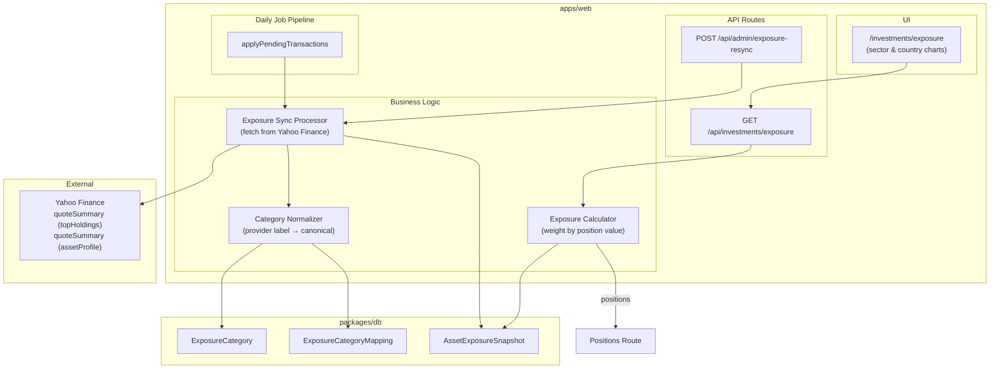

# Design Document

## Overview

The Portfolio Exposure feature provides look-through exposure analysis of the user's investment portfolio. It aggregates asset-level sector and country breakdowns — weighted by current position values — into a unified portfolio view. The system stores monthly exposure snapshots fetched from Yahoo Finance, normalizes provider-specific labels via a canonical mapping table, and exposes the data through a dedicated API endpoint and UI page. Exposure sync runs as an additional step within the existing daily job pipeline.

## Architecture



## Components and Interfaces

### API Route: GET /api/investments/exposure

Returns aggregated portfolio-level exposure breakdowns (sector or country) for a given period, optionally scoped to a single account. Computes weighted exposure by combining per-asset snapshot percentages with current position values.

### API Route: POST /api/admin/exposure-resync

Admin endpoint that triggers a re-sync of exposure data for a specific asset and period, overwriting existing snapshots. Uses server action pattern consistent with the admin panel.

### Service: Exposure Sync Processor

Fetches exposure data from Yahoo Finance for all assets with active positions. For ETFs/Funds, uses `quoteSummary` with the `topHoldings` module. For individual equities, uses `quoteSummary` with the `assetProfile` module. Skips assets that already have snapshots for the current period.

### Service: Category Normalizer

Resolves provider-specific labels (e.g., Yahoo Finance's "Technology Services") to canonical ExposureCategory records via ExposureCategoryMapping. Auto-creates new categories and mappings when encountering unknown labels.

### Service: Exposure Calculator

Computes portfolio-level exposure by:
1. Fetching all positions (reusing existing position computation logic)
2. For each position, looking up AssetExposureSnapshot records for the requested period and type
3. Weighting each asset's category percentages by `positionValue / totalPortfolioValue`
4. Summing weighted percentages per canonical category
5. Computing coverage percentage and uncovered value

### UI Page: /investments/exposure

Displays sector and country exposure breakdowns using ECharts pie/donut charts, a summary table with category name, percentage, and monetary value, plus a coverage indicator.

## Data Models

### New Enum: ExposureType

```prisma
enum ExposureType {
  SECTOR
  COUNTRY
}
```

### New Model: ExposureCategory

Canonical mapping table for normalized exposure categories. Each category has a unique `canonical_key` per `exposure_type`.

```prisma
model ExposureCategory {
  id             Int          @id @default(autoincrement())
  exposure_type  ExposureType
  canonical_key  String       @db.VarChar(100)
  display_name   String       @db.VarChar(150)
  created_at     DateTime     @default(now())

  mappings  ExposureCategoryMapping[]
  snapshots AssetExposureSnapshot[]

  @@unique([exposure_type, canonical_key], name: "type_canonical_key")
}
```

### New Model: ExposureCategoryMapping

Maps a raw provider label to a canonical ExposureCategory. Allows multiple provider labels to resolve to the same canonical category.

```prisma
model ExposureCategoryMapping {
  id             Int           @id @default(autoincrement())
  provider       AssetProvider
  provider_label String        @db.VarChar(200)
  category_id    Int
  created_at     DateTime      @default(now())

  category ExposureCategory @relation(fields: [category_id], references: [id])

  @@unique([provider, provider_label, category_id], name: "provider_label_category")
  @@index([provider, provider_label])
}
```

### New Model: AssetExposureSnapshot

Stores per-asset, per-period, per-type, per-category percentage allocations.

```prisma
model AssetExposureSnapshot {
  id          Int          @id @default(autoincrement())
  asset_id    Int
  period      String       @db.VarChar(7)  // "YYYY-MM"
  exposure_type ExposureType
  category_id Int
  percentage  Decimal      @db.Decimal(7, 4)  // e.g., 23.4500
  provider    AssetProvider
  synced_at   DateTime     @default(now())

  asset    Asset            @relation(fields: [asset_id], references: [id], onDelete: Cascade)
  category ExposureCategory @relation(fields: [category_id], references: [id])

  @@unique([asset_id, period, exposure_type, category_id], name: "asset_period_type_category")
  @@index([asset_id, period, exposure_type])
}
```

### Modified Model: Asset

Add relation:

```prisma
model Asset {
  // ... existing relations ...
  exposureSnapshots AssetExposureSnapshot[]
}
```

## API Design

### GET /api/investments/exposure

Returns aggregated portfolio exposure for a given type and period.

**Query Parameters (Zod Schema):**

```typescript
const exposureQuerySchema = z.object({
  type: z.enum(["SECTOR", "COUNTRY"]),
  period: z.string().regex(/^\d{4}-(0[1-9]|1[0-2])$/).optional(),
  accountId: z.coerce.number().int().positive().optional(),
});
```

**Logic Flow:**

1. Validate query params with Zod → 400 on failure
2. Default `period` to current month (YYYY-MM from `getEuropeMadridDateParts()`)
3. Fetch positions (reuse position computation logic):
   - If `accountId` provided: positions for that account only
   - If no `accountId`: aggregate positions across all active accounts
4. Compute `totalPortfolioValue` = sum of all position current values (units × latest price)
5. For each position with a current value:
   - Look up `AssetExposureSnapshot` records for that asset, period, and type
   - Weight each category percentage by `positionValue / totalPortfolioValue`
6. Sum weighted percentages per category across all assets
7. Compute `coveragePercentage` = sum of position values that have snapshot data / totalPortfolioValue × 100
8. Compute `uncoveredValue` = totalPortfolioValue − sum of covered position values
9. Return response

**Response:**

```typescript
{
  data: Array<{
    categoryId: number;
    categoryName: string;
    percentage: number;       // 0-100 weighted portfolio percentage
    value: number;            // monetary value in portfolio currency
  }>;
  coveragePercentage: number; // 0-100
  uncoveredValue: number;     // monetary amount without exposure data
  totalPortfolioValue: number;
  period: string;             // "YYYY-MM"
  type: "SECTOR" | "COUNTRY";
  positions: Array<{
    assetId: number;
    name: string;
    ticker: string;
    value: number;            // position monetary value
    percentage: number;       // position % of total portfolio value
  }>;                         // sorted by percentage descending
}
```

### POST /api/admin/exposure-resync

Admin endpoint to re-sync exposure data for a specific asset.

**Request Body (Zod Schema):**

```typescript
const resyncSchema = z.object({
  assetId: z.number().int().positive(),
  period: z.string().regex(/^\d{4}-(0[1-9]|1[0-2])$/),
});
```

**Logic Flow:**

1. Validate request body → 400 on failure
2. Verify asset exists → 404 if not
3. Fetch fresh exposure data from Yahoo Finance for the asset
4. Delete all existing `AssetExposureSnapshot` records for that asset + period
5. Insert new snapshot records
6. Return 200 with sync summary

**Response:**

```typescript
{
  assetId: number;
  period: string;
  sectorsCreated: number;
  countriesCreated: number;
}
```

## Exposure Sync Algorithm

The exposure sync processor runs as an additional step in the daily job pipeline (`applyPendingTransactionsForCurrentMadridMonth`). It determines the current period (YYYY-MM) and processes all assets with active positions.

### Processor: syncExposureData

```typescript
// apps/web/app/api/_lib/jobs/processors/exposureSync.ts

export async function syncExposureData(jobRunId: number): Promise<ProcessCounts> {
  const counts: ProcessCounts = { processed: 0, failed: 0, skipped: 0 };
  const { year, month } = getEuropeMadridDateParts();
  const period = `${year}-${String(month).padStart(2, "0")}`;

  // 1. Get all assets with active positions (units > 0)
  const assetsWithPositions = await getAssetsWithActivePositions();

  for (const asset of assetsWithPositions) {
    try {
      // 2. Check if snapshots already exist for this asset + period
      const existingCount = await prisma.assetExposureSnapshot.count({
        where: { asset_id: asset.id, period },
      });

      if (existingCount > 0) {
        counts.skipped += 1;
        continue;
      }

      // 3. Fetch exposure data from Yahoo Finance
      const exposureData = await fetchExposureFromYahoo(asset);

      if (!exposureData) {
        counts.skipped += 1;
        continue;
      }

      // 4. Normalize labels and create snapshots
      await createExposureSnapshots(asset.id, period, exposureData);
      counts.processed += 1;
    } catch (error) {
      counts.failed += 1;
      // Log error but continue processing remaining assets
    }
  }

  return counts;
}
```

### Yahoo Finance Data Fetching

```typescript
async function fetchExposureFromYahoo(asset: AssetWithMapping): Promise<ExposureData | null> {
  const symbol = asset.providerMappings[0]?.provider_symbol;
  if (!symbol) return null;

  if (asset.asset_type === "STOCK") {
    // Use assetProfile for individual equities
    const result = await yahooFinance.quoteSummary(symbol, { modules: ["assetProfile"] });
    const profile = result.assetProfile;
    if (!profile) return null;

    return {
      sectors: profile.sector ? [{ label: profile.sector, percentage: 100 }] : [],
      countries: profile.country ? [{ label: profile.country, percentage: 100 }] : [],
    };
  } else {
    // ETF/FUND/ETP: Use topHoldings for breakdown
    const result = await yahooFinance.quoteSummary(symbol, { modules: ["topHoldings"] });
    const holdings = result.topHoldings;
    if (!holdings) return null;

    const sectors = (holdings.sectorWeightings ?? []).flatMap((entry) =>
      Object.entries(entry).map(([label, pct]) => ({
        label,
        percentage: (pct as number) * 100,
      }))
    );

    // Country data from holdings breakdown
    const countries = extractCountryBreakdown(holdings);

    return { sectors, countries };
  }
}
```

### Category Normalization

```typescript
async function resolveCanonicalCategory(
  provider: AssetProvider,
  providerLabel: string,
  exposureType: ExposureType,
): Promise<number> {
  // 1. Check existing mapping
  const existing = await prisma.exposureCategoryMapping.findFirst({
    where: { provider, provider_label: providerLabel },
    include: { category: true },
  });

  if (existing) return existing.category_id;

  // 2. Auto-create canonical category + mapping
  const canonicalKey = providerLabel.toLowerCase().replace(/\s+/g, "-");
  const category = await prisma.exposureCategory.upsert({
    where: { type_canonical_key: { exposure_type: exposureType, canonical_key: canonicalKey } },
    create: { exposure_type: exposureType, canonical_key: canonicalKey, display_name: providerLabel },
    update: {},
  });

  await prisma.exposureCategoryMapping.create({
    data: { provider, provider_label: providerLabel, category_id: category.id },
  });

  return category.id;
}
```

## Admin Re-Sync Endpoint

The admin re-sync endpoint allows overwriting existing snapshots for a specific asset and period. It follows the same server action pattern as the existing admin panel.

```typescript
// apps/web/app/api/admin/exposure-resync/route.ts

export async function POST(request: Request) {
  // 1. Validate body
  // 2. Verify asset exists
  // 3. Fetch fresh data from Yahoo Finance
  // 4. Delete existing snapshots for asset + period (both SECTOR and COUNTRY)
  // 5. Insert new snapshots with normalized categories
  // 6. Return summary
}
```

On failure to retrieve data from Yahoo Finance, the endpoint returns a 502 error without modifying existing records (atomic: delete + insert only occur after successful fetch).

## UI Page Design

### Route: /investments/exposure

```
apps/web/app/investments/
├── exposure/
│   └── page.tsx          # Server component: fetches data, renders layout
└── layout.tsx            # (optional) shared investments layout
```

### Page Components

```
components/investments/
├── ExposurePage.tsx           # Client component: manages type toggle state
├── ExposurePieChart.tsx       # ECharts donut chart for category breakdown
├── ExposureTable.tsx          # TanStack Table: category, %, value
├── CoverageIndicator.tsx     # Shows coverage % with visual indicator
└── ExposureTypeToggle.tsx    # Toggle between SECTOR / COUNTRY
```

### Page Layout

```
┌─────────────────────────────────────────────────────────┐
│ Portfolio Exposure                                       │
├─────────────────────────────────────────────────────────┤
│ [SECTOR] [COUNTRY]        Period: 2025-01    Coverage: 87% │
├──────────────────────┬──────────────────────────────────┤
│                      │  Category      │  %     │  Value │
│   ┌──────────┐       │  Technology    │ 32.5%  │ €12,400│
│   │  Donut   │       │  Healthcare   │ 18.2%  │ €6,950 │
│   │  Chart   │       │  Financials   │ 15.8%  │ €6,030 │
│   │          │       │  ...          │  ...   │  ...   │
│   └──────────┘       │  Other/Unclass│  4.1%  │ €1,565 │
│                      │               │        │        │
└──────────────────────┴──────────────────────────────────┘
```

The "Other / Unclassified" bucket is computed client-side: `100% - sum(category percentages)` applied to the covered portion of the portfolio. If the sum of reported percentages for covered assets is less than 100%, the remainder is shown as "Other / Unclassified".

## Error Handling

| Scenario | HTTP Status | Response |
|----------|-------------|----------|
| Invalid `type` parameter | 400 | `{ error: "Validation failed", details }` |
| Invalid `period` format | 400 | `{ error: "Validation failed", details }` |
| No positions found | 200 | `{ data: [], coveragePercentage: 0, ... }` |
| Asset not found (re-sync) | 404 | `{ error: "Asset not found" }` |
| Yahoo Finance fetch fails (re-sync) | 502 | `{ error: "Failed to fetch exposure data from provider" }` |
| Yahoo Finance fails during sync | — | Skip asset, increment `failed` count |
| Asset has no provider mapping | — | Skip asset during sync |
| Internal error | 500 | `{ error: "Failed to fetch exposure data" }` |

## File Structure

```
apps/web/app/
├── api/
│   ├── investments/
│   │   └── exposure/
│   │       └── route.ts                    # GET /api/investments/exposure
│   ├── admin/
│   │   └── exposure-resync/
│   │       └── route.ts                    # POST /api/admin/exposure-resync
│   └── _lib/
│       └── jobs/
│           └── processors/
│               └── exposureSync.ts         # Exposure sync processor
├── investments/
│   └── exposure/
│       └── page.tsx                        # Exposure UI page
└── components/
    └── investments/
        ├── ExposurePage.tsx
        ├── ExposurePieChart.tsx
        ├── ExposureTable.tsx
        ├── CoverageIndicator.tsx
        └── ExposureTypeToggle.tsx

packages/db/prisma/
└── schema.prisma                           # ExposureCategory, ExposureCategoryMapping, AssetExposureSnapshot

apps/web/app/api/_lib/
└── exposure/
    ├── calculator.ts                       # Portfolio exposure calculation logic
    ├── normalizer.ts                       # Category normalization logic
    └── yahooFetcher.ts                     # Yahoo Finance exposure data fetching
```

## Correctness Properties

*A property is a characteristic or behavior that should hold true across all valid executions of a system — essentially, a formal statement about what the system should do. Properties serve as the bridge between human-readable specifications and machine-verifiable correctness guarantees.*

### Property 1: Weighted exposure calculation

*For any* portfolio of positions (each with a current value and per-category exposure percentages), the calculated portfolio exposure for each category SHALL equal the sum of `(assetCategoryPercentage × positionValue) / totalPortfolioValue`, and the monetary value for each category SHALL equal `percentage / 100 × totalPortfolioValue`.

**Validates: Requirements 1.1, 1.3**

### Property 2: Account filtering consistency

*For any* multi-account portfolio, the exposure calculated with an `accountId` filter SHALL include only positions from that account, and the exposure calculated without an `accountId` filter SHALL include positions from all accounts. The unfiltered result's total portfolio value SHALL equal the sum of all individual accounts' portfolio values.

**Validates: Requirements 1.4, 1.5**

### Property 3: Exposure percentages bounded by coverage

*For any* portfolio that contains assets without exposure data, the sum of all category percentages in the response SHALL be less than or equal to the `coveragePercentage`, because the denominator (totalPortfolioValue) includes uncovered assets.

**Validates: Requirements 1.6**

### Property 4: Coverage and uncovered value calculation

*For any* portfolio, `coveragePercentage` SHALL equal the sum of position values for assets with exposure snapshot data divided by the total portfolio value, multiplied by 100. `uncoveredValue` SHALL equal `totalPortfolioValue - coveredValue`. The invariant `coveragePercentage >= 0 AND coveragePercentage <= 100` SHALL always hold.

**Validates: Requirements 7.1, 7.2, 7.4**

### Property 5: Category normalization idempotency

*For any* provider label string, resolving it to a canonical category multiple times SHALL always return the same `category_id`. If the label has no existing mapping, a new ExposureCategory and ExposureCategoryMapping SHALL be created on first resolution and reused on subsequent resolutions.

**Validates: Requirements 3.1, 3.3**

### Property 6: Individual equities assigned 100% to their category

*For any* asset of type STOCK with available sector and country data, the exposure sync SHALL produce exactly one AssetExposureSnapshot per exposure type with `percentage = 100`. If sector or country data is missing, no snapshot SHALL be created for the missing type.

**Validates: Requirements 4.1, 4.2, 4.3**

### Property 7: ETF/Fund entries produce one snapshot per category

*For any* ETF or FUND asset with N sector entries and M country entries reported by the provider, the exposure sync SHALL produce exactly N sector snapshots and M country snapshots, each with the percentage reported by the provider.

**Validates: Requirements 5.2**

### Property 8: Unclassified remainder computation

*For any* set of exposure category percentages for a given asset and type that sum to less than 100%, the "Other / Unclassified" bucket SHALL equal `100% - sum(categoryPercentages)`. When percentages sum to exactly 100%, no "Other" bucket SHALL be displayed.

**Validates: Requirements 6.1, 11.5**

### Property 9: Raw percentages stored without normalization

*For any* provider-reported exposure data where category percentages sum to less than 100%, the stored AssetExposureSnapshot percentage values SHALL exactly match the raw provider values without being scaled to sum to 100%.

**Validates: Requirements 6.2**

### Property 10: Sync skips already-synced assets

*For any* asset that already has AssetExposureSnapshot records for the current period, the regular sync execution SHALL not create, modify, or delete existing snapshot records for that asset. The processor SHALL report the asset as "skipped".

**Validates: Requirements 2.4**

### Property 11: Sync fault tolerance

*For any* set of assets being processed during sync where a subset of Yahoo Finance calls fail, the processor SHALL still create snapshots for all non-failing assets. Failed assets SHALL be counted in the `failed` count and SHALL not affect processing of remaining assets.

**Validates: Requirements 8.3**

### Property 12: Re-sync overwrites existing snapshots

*For any* asset and period with pre-existing AssetExposureSnapshot records, a successful re-sync SHALL delete all previous snapshot records for that asset+period and replace them with the newly fetched data. Post re-sync, only records matching the fresh provider data SHALL exist.

**Validates: Requirements 9.2**

### Property 13: Failed re-sync preserves existing records

*For any* asset and period with pre-existing AssetExposureSnapshot records, if the re-sync fails to fetch data from Yahoo Finance, all existing snapshot records SHALL remain unchanged (same count, same values).

**Validates: Requirements 9.3**

### Property 14: Invalid input rejection

*For any* string value that is not "SECTOR" or "COUNTRY" passed as the `type` parameter, or any string that does not match the `YYYY-MM` format passed as the `period` parameter, the Exposure API SHALL return HTTP 400 with validation details.

**Validates: Requirements 10.5, 10.6**

## Testing Strategy

### Unit Tests
- Exposure calculator: specific scenarios (single asset, no positions, all assets without data)
- Category normalizer: auto-creation of new categories, resolution of existing mappings
- Yahoo Finance fetcher: response parsing for STOCK vs ETF/FUND
- Admin re-sync: error handling when Yahoo Finance fails
- API validation: specific invalid inputs and edge cases

### Property Tests
Property tests use `fast-check` with minimum 100 iterations per property, consistent with the existing test patterns in the codebase (`computeMissingRanges.property.test.ts` etc.).

Each property test is tagged with a comment referencing its design property:
- **Feature: portfolio-exposure, Property 1: Weighted exposure calculation**
- **Feature: portfolio-exposure, Property 2: Account filtering consistency**
- **Feature: portfolio-exposure, Property 3: Exposure percentages bounded by coverage**
- **Feature: portfolio-exposure, Property 4: Coverage and uncovered value calculation**
- **Feature: portfolio-exposure, Property 5: Category normalization idempotency**
- **Feature: portfolio-exposure, Property 6: Individual equities assigned 100%**
- **Feature: portfolio-exposure, Property 7: ETF/Fund entries produce one snapshot per category**
- **Feature: portfolio-exposure, Property 8: Unclassified remainder computation**
- **Feature: portfolio-exposure, Property 9: Raw percentages stored without normalization**
- **Feature: portfolio-exposure, Property 10: Sync skips already-synced assets**
- **Feature: portfolio-exposure, Property 11: Sync fault tolerance**
- **Feature: portfolio-exposure, Property 12: Re-sync overwrites existing snapshots**
- **Feature: portfolio-exposure, Property 13: Failed re-sync preserves existing records**
- **Feature: portfolio-exposure, Property 14: Invalid input rejection**

### Integration Tests
- End-to-end API route behavior with real DB
- Daily job integration: sync processor invocation within pipeline
- Admin re-sync overwrites existing records correctly
- Yahoo Finance quoteSummary integration (topHoldings and assetProfile modules)

