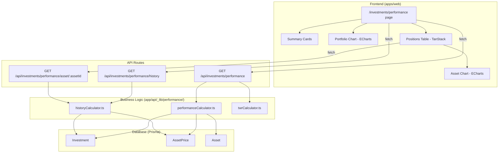

# Design Document: Portfolio Performance

## Overview

The Portfolio Performance feature adds a unified view showing investment gains/losses, time-weighted returns, daily changes, and historical value evolution. It introduces three new API endpoints that compute performance metrics from existing `Investment`, `AssetPrice`, and `Asset` data, plus a frontend page with summary cards, a portfolio value chart, and a positions table with expandable per-asset charts.

No new database models are required. All metrics are derived at request time from COMPLETED investment operations and historical price data. The computation logic is extracted into pure functions for testability and reusability.

## Architecture



### Design Decisions

1. **Pure computation modules**: Business logic (position aggregation, TWR, historical value) is extracted into pure functions in `app/api/_lib/performance/`. This matches the existing pattern (`_lib/exposure/calculator.ts`) and enables property-based testing without mocking the database.

2. **No caching layer**: Given a single-user app, the computation runs on each request. Historical series computation walks events chronologically which is efficient for personal portfolio sizes (< 100 assets, < 1000 operations). Optimization can be added later if needed.

3. **Average cost method**: Sells reduce cost basis using `total_invested / total_units` at time of sale, matching the existing positions pattern. This avoids the complexity of FIFO/LIFO lot tracking.

4. **Carry-forward pricing**: When a date lacks price data for an asset, the last known price is carried forward. This is standard for financial portfolio valuation.

## Components and Interfaces

### API Layer

#### `GET /api/investments/performance`

Returns aggregated portfolio summary and per-position metrics.

```typescript
// Route: apps/web/app/api/investments/performance/route.ts
// Zod validation: none required (no params)
// Response shape:
interface PerformanceResponse {
  summary: {
    total_invested: string;      // Decimal as string
    total_current_value: string;
    total_pnl: string;
    total_pnl_pct: string;
    twr: string;
    daily_change: string;
    daily_change_pct: string;
    previous_value: string;
  };
  positions: PositionDTO[];
}

interface PositionDTO {
  asset_id: number;
  asset: { ticker: string; name: string; asset_type: string; currency: string };
  total_units: string;
  total_invested: string;
  avg_cost: string;
  current_price: string;
  current_value: string;
  unrealized_pnl: string;
  unrealized_pct: string;
  weight: string;
  daily_change: string;
  daily_change_pct: string;
  price_updated_at: string | null;
}
```

#### `GET /api/investments/performance/history?timeframe=`

Returns historical portfolio value series for charting.

```typescript
// Route: apps/web/app/api/investments/performance/history/route.ts
// Zod validation: timeframe query param
const historyQuerySchema = z.object({
  timeframe: z.enum(["1M", "3M", "6M", "1Y", "YTD", "ALL"]).default("1Y"),
});

interface HistoryResponse {
  series: Array<{
    date: string;           // YYYY-MM-DD
    portfolio_value: string;
    total_invested: string;
  }>;
  timeframe: string;
}
```

#### `GET /api/investments/performance/asset/:assetId?timeframe=`

Returns per-asset historical value series with operations.

```typescript
// Route: apps/web/app/api/investments/performance/asset/[assetId]/route.ts
// Zod validation: assetId param + timeframe query
const assetPerformanceSchema = z.object({
  assetId: z.coerce.number().int().positive(),
  timeframe: z.enum(["1M", "3M", "6M", "1Y", "YTD", "ALL"]).default("1Y"),
});

interface AssetPerformanceResponse {
  asset: { id: number; ticker: string; name: string; asset_type: string };
  summary: {
    total_units: string;
    total_invested: string;
    avg_cost: string;
    current_price: string;
    current_value: string;
    unrealized_pnl: string;
    unrealized_pct: string;
    daily_change: string;
    daily_change_pct: string;
  };
  series: Array<{
    date: string;
    position_value: string;
    cost_basis: string;
  }>;
  operations: Array<{
    date: string;
    type: "BUY" | "SELL";
    units: string;
    total_amount: string;
  }>;
  timeframe: string;
}
```

### Business Logic Layer

Located at `apps/web/app/api/_lib/performance/`:

#### `performanceCalculator.ts`

```typescript
export type InvestmentInput = {
  asset_id: number;
  type: "BUY" | "SELL";
  units: number;
  total_amount: number;
  executed_at: Date;
};

export type PriceInput = {
  asset_id: number;
  price: number;
  timestamp: Date;
};

export type PositionResult = {
  asset_id: number;
  total_units: number;
  total_invested: number; // cost basis after sell adjustments
  avg_cost: number;
  current_price: number;
  current_value: number;
  unrealized_pnl: number;
  unrealized_pct: number;
  weight: number;
  daily_change: number;
  daily_change_pct: number;
};

export type PortfolioSummaryResult = {
  total_invested: number;
  total_current_value: number;
  total_pnl: number;
  total_pnl_pct: number;
  daily_change: number;
  daily_change_pct: number;
  previous_value: number;
  positions: PositionResult[];
};

/**
 * Pure function: computes portfolio positions with performance metrics.
 * Operates on pre-fetched data — no DB calls.
 */
export function computePortfolioPerformance(
  investments: InvestmentInput[],
  currentPrices: Map<number, PriceInput>,
  previousPrices: Map<number, PriceInput>,
): PortfolioSummaryResult;

/**
 * Pure function: computes cost basis for a single asset using average cost method.
 * Returns the adjusted cost basis and units after processing all operations chronologically.
 */
export function computeCostBasis(
  operations: InvestmentInput[],
): { totalUnits: number; costBasis: number; avgCost: number };
```

#### `historyCalculator.ts`

```typescript
export type HistoryInput = {
  investments: InvestmentInput[];
  prices: Map<number, Array<{ date: string; price: number }>>;
  startDate: string; // YYYY-MM-DD
  endDate: string;
};

export type HistoryPoint = {
  date: string;
  portfolio_value: number;
  total_invested: number;
};

/**
 * Pure function: computes daily portfolio value series.
 * Walks chronologically through dates, applying BUY/SELL events
 * and using carry-forward for missing prices.
 */
export function computePortfolioHistory(input: HistoryInput): HistoryPoint[];

/**
 * Pure function: computes per-asset daily value series.
 */
export function computeAssetHistory(
  assetInvestments: InvestmentInput[],
  prices: Array<{ date: string; price: number }>,
  startDate: string,
  endDate: string,
): Array<{ date: string; position_value: number; cost_basis: number }>;
```

#### `twrCalculator.ts`

```typescript
export type CashFlowEvent = {
  date: string;       // YYYY-MM-DD
  amount: number;     // positive for inflow (BUY), negative for outflow (SELL)
  portfolio_value_before: number;
};

/**
 * Pure function: computes Time-Weighted Return using modified Dietz method.
 * Sub-periods are defined by cash flow events (BUY/SELL operations).
 * TWR = product of (1 + R_i) - 1, where R_i = (V_end - V_start) / V_start
 */
export function computeTWR(
  cashFlows: CashFlowEvent[],
  startValue: number,
  endValue: number,
): number;
```

### Frontend Components

Located at `apps/web/app/investments/performance/` and `apps/web/components/performance/`:

| Component | Type | Responsibility |
|-----------|------|----------------|
| `page.tsx` | RSC | Server component, fetches initial data, renders layout |
| `PerformanceView.tsx` | Client | Orchestrates summary + chart + table |
| `PerformanceSummaryCards.tsx` | Client | Renders 6 summary metric cards |
| `PortfolioValueChart.tsx` | Client | ECharts area chart with invested baseline |
| `PositionsTable.tsx` | Client | TanStack DataTable with sortable columns |
| `AssetPerformanceDetail.tsx` | Client | Expandable row content: asset chart + stats |
| `AssetValueChart.tsx` | Client | ECharts area chart with green/red shading |
| `TimeframeSelector.tsx` | Client | Shared 1M/3M/6M/1Y/YTD/ALL toggle |

### Navigation Integration

Add "Performance" link to the existing investments section. The investments layout at `apps/web/app/investments/layout.tsx` will be updated to include navigation tabs linking to `/investments` (Portfolio), `/investments/performance`, `/investments/compare`, and `/investments/exposure`.

## Data Models

No new database models. All computations derive from:

### Existing Models Used

| Model | Fields Used | Purpose |
|-------|------------|---------|
| `Investment` | `asset_id`, `type`, `units`, `unit_price`, `total_amount`, `executed_at`, `status`, `account_id` | Source of BUY/SELL operations |
| `AssetPrice` | `asset_id`, `timestamp`, `price`, `granularity` | Historical and current prices |
| `Asset` | `id`, `ticker`, `name`, `asset_type`, `currency` | Position metadata |

### Derived Data Structures

```typescript
// Position aggregation (computed per request)
type Position = {
  asset_id: number;
  total_units: number;        // Σ BUY units - Σ SELL units
  total_invested: number;     // Cost basis after average-cost sell adjustments
  avg_cost: number;           // total_invested / total_units
  current_price: number;      // Latest AssetPrice
  current_value: number;      // total_units × current_price
  unrealized_pnl: number;     // current_value - total_invested
  unrealized_pct: number;     // (unrealized_pnl / total_invested) × 100
  weight: number;             // (current_value / portfolio_total) × 100
  daily_change: number;       // current_value - previous_value
  daily_change_pct: number;   // (daily_change / previous_value) × 100
  price_updated_at: Date;     // Timestamp of latest price
};
```

### Cost Basis Calculation (Average Cost Method)

```
For each SELL operation chronologically:
  avg_cost_at_sale = total_invested / total_units
  cost_reduction = units_sold × avg_cost_at_sale
  total_invested -= cost_reduction
  total_units -= units_sold
```

### Historical Value Computation

```
For each date in [startDate..endDate]:
  For each asset:
    units_held = walk BUY/SELL events up to this date
    price = AssetPrice for this date (or carry-forward last known)
    position_value = units_held × price
  portfolio_value = Σ position_value
  total_invested = cumulative cost basis at this date
```

### TWR Computation (Modified Dietz)

```
Sub-periods are bounded by cash flow events (BUY/SELL dates).
For sub-period i:
  R_i = (V_end - V_start) / V_start
  where V_start = portfolio value at start of sub-period (post prior cash flow)
  and V_end = portfolio value at end of sub-period (pre next cash flow)
TWR = Π(1 + R_i) - 1
```

## Correctness Properties

*A property is a characteristic or behavior that should hold true across all valid executions of a system — essentially, a formal statement about what the system should do. Properties serve as the bridge between human-readable specifications and machine-verifiable correctness guarantees.*

### Property 1: Portfolio summary arithmetic consistency

*For any* set of COMPLETED BUY and SELL investments and any set of current prices, the computed portfolio summary SHALL satisfy:
- `total_invested` = Σ(BUY amounts) − Σ(SELL cost reductions using average cost)
- `total_current_value` = Σ(position_units × current_price) for all active positions
- `total_pnl` = `total_current_value` − `total_invested`
- `total_pnl_pct` = (`total_pnl` / `total_invested`) × 100

**Validates: Requirements 1.1, 1.2, 1.4, 1.5**

### Property 2: Cross-account position aggregation

*For any* set of investments spread across multiple account_ids but referencing the same asset_id, the portfolio computation SHALL produce exactly one position per distinct asset_id with units and amounts aggregated across all accounts.

**Validates: Requirements 1.6**

### Property 3: Daily change consistency

*For any* set of active positions with both current and previous prices available, the portfolio daily_change SHALL equal `current_total_value − previous_total_value`, and each position's daily_change SHALL equal `units × (current_price − previous_price)`, and the sum of all per-position daily changes SHALL equal the portfolio-level daily_change.

**Validates: Requirements 2.1, 2.4**

### Property 4: Cost basis with average cost method

*For any* chronological sequence of BUY and SELL operations for a single asset where total sells never exceed total buys, the cost basis SHALL satisfy:
- After each BUY: `cost_basis += buy_amount`, `units += buy_units`
- After each SELL: `cost_basis -= sell_units × (cost_basis / units)`, `units -= sell_units`
- At all times: `avg_cost = cost_basis / units`
- The final cost basis and avg_cost match the computeCostBasis function output.

**Validates: Requirements 3.2, 10.1, 10.2**

### Property 5: Position weights sum to 100%

*For any* portfolio with at least one active position where all positions have valid current prices, the sum of all position weights SHALL equal 100% (within floating point tolerance of ±0.01%).

**Validates: Requirements 3.3**

### Property 6: Portfolio history value correctness

*For any* set of investments and daily prices spanning a date range, the computed history series SHALL satisfy at each date point:
- `portfolio_value` = Σ(units_held_at_date × price_at_date) for all assets
- `total_invested` = cumulative cost basis at that date (BUY amounts minus sell cost reductions up to that date)
- On dates where a BUY/SELL occurs, units_held reflects the post-transaction state (end-of-day position)

**Validates: Requirements 4.2, 4.3, 4.7**

### Property 7: Price carry-forward in history

*For any* asset with a price series that has gaps (missing dates), the history computation SHALL use the last known price for dates without price data. Specifically, if price exists on date D₁ but not on D₂ > D₁, the value at D₂ uses D₁'s price until a newer price is available.

**Validates: Requirements 4.6**

### Property 8: TWR multiplicative formula

*For any* sequence of cash flow events with valid portfolio values at each sub-period boundary (V_start > 0), the TWR SHALL equal `Π(1 + R_i) − 1` where `R_i = (V_end − V_start) / V_start` for each sub-period between consecutive cash flows. When there are no cash flows, TWR SHALL equal the simple return `(V_end − V_start) / V_start`.

**Validates: Requirements 6.1, 6.2, 6.3, 6.4**

### Property 9: Missing price exclusion from totals

*For any* portfolio where some assets have no price data (empty currentPrices for that asset_id), those positions SHALL be excluded from `total_current_value`, `total_pnl`, and weight calculations, and the remaining positions' weights SHALL still sum to 100%.

**Validates: Requirements 7.2**

### Property 10: Invalid timeframe defaults to 1Y

*For any* string value that is not one of "1M", "3M", "6M", "1Y", "YTD", or "ALL" passed as the timeframe query parameter, the History API SHALL treat it as "1Y" and return a response with `timeframe: "1Y"`.

**Validates: Requirements 8.4**

### Property 11: Invalid route parameters return HTTP 400

*For any* non-numeric or non-positive value passed as the `assetId` route parameter to the Asset Performance API, the endpoint SHALL return HTTP 400 with validation error details.

**Validates: Requirements 8.5**

## Error Handling

| Error Scenario | Handling Strategy | HTTP Status |
|---|---|---|
| No active positions (all sold or no investments) | Return empty positions array with zeroed summary | 200 |
| Asset has no price data | Exclude from value totals, return `current_price: null`, `current_value: null` | 200 |
| Stale price (>24h old) | Include `price_updated_at` in response; frontend shows warning indicator | 200 |
| No previous day price data | Return `daily_change: null`, `daily_change_pct: null` | 200 |
| Invalid assetId parameter | Zod validation error | 400 |
| Invalid timeframe (for history) | Default to "1Y" per spec | 200 |
| Asset not found for asset performance endpoint | Return 404 with error message | 404 |
| Database connection failure | Catch all, return generic error | 500 |
| Division by zero (zero invested) | Return 0% for pnl_pct and weight | 200 |
| TWR computation with V_start = 0 | Skip sub-period (return 0% TWR for that sub-period) | 200 |

### Error Response Format

Follows existing project pattern:
```typescript
// Validation error (400)
{ "error": "Validation failed", "details": ZodError.issues }

// Not found (404)
{ "error": "Asset not found" }

// Server error (500)
{ "error": "Failed to fetch performance data" }
```

## Testing Strategy

### Property-Based Tests (fast-check)

Property-based tests target the pure computation modules in `app/api/_lib/performance/`. Each test runs a minimum of 100 iterations with randomized inputs.

**Library:** `fast-check` (already used in the project — see `exposure.property.test.ts`)
**Runner:** `vitest`

| Test File | Properties Covered | Module Under Test |
|---|---|---|
| `performanceCalculator.property.test.ts` | Properties 1, 2, 3, 5, 9 | `computePortfolioPerformance`, `computeCostBasis` |
| `historyCalculator.property.test.ts` | Properties 6, 7 | `computePortfolioHistory`, `computeAssetHistory` |
| `twrCalculator.property.test.ts` | Property 8 | `computeTWR` |
| `costBasis.property.test.ts` | Property 4 | `computeCostBasis` |
| `performance-api.property.test.ts` | Properties 10, 11 | Route handlers (validation) |

**Configuration:**
- Each property test runs with `{ numRuns: 100 }`
- Each test file includes a comment: `/** Feature: portfolio-performance, Property N: <property_text> */`

### Unit Tests (example-based)

| Area | What to Test |
|---|---|
| Summary cards rendering | All 6 metrics display correctly (Req 1.3) |
| Daily change badge formatting | Green/red color, "+€X.XX (+Y.YY%)" format (Req 2.2) |
| Empty state | Message appears when no positions (Req 7.1) |
| Stale price indicator | Warning shown when price > 24h old (Req 7.3) |
| Positions table default sort | Current value descending (Req 3.4) |
| Chart timeframe selector | All 6 options render and trigger callback (Req 4.4) |
| Navigation link | "Performance" tab present in investments nav (Req 9.2) |

### Integration Tests

| Scenario | What to Verify |
|---|---|
| Full API flow with seeded DB | Response shape matches TypeScript interfaces |
| PENDING/CANCELLED filtering | Only COMPLETED investments affect output (Req 7.4) |
| Asset performance with operations | Returns only operations for requested assetId (Req 5.7) |
| Cross-account aggregation end-to-end | Same asset across accounts merged in response |

</text>
</invoke>