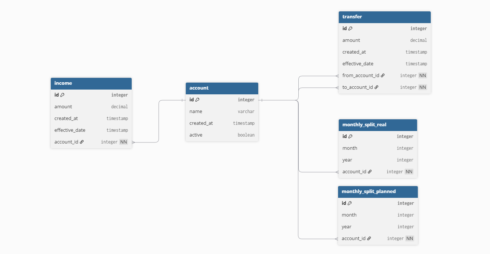

# FinanceApp

FinanceApp helps you track your finances easily.  
It allows you to manage multiple bank accounts, investments, and transfers in one place.

It is usual to own many bank accounts for different purposes: investing, saving up, daily usage... This makes difficult to track the money. To maintain good finances it is useful to have everything tracked in one place. This allows planning ahead and prevents that sense of moving money with no purpose.

# Useful Links
Domain model (UML)
ERD (Entity Relationship Diagram): https://dbdiagram.io/d/6988d001bd82f5fce207a50d



# Features

### Main Features
- Create & List
  - Accounts
  - Incomes to these accounts
  - Transactions between accounts
  - Monthly Splits across accounts (The splits planned at the beginning of the month)
  - Investments in different products in these accounts
- View
  - Current amount in each account
  - Monthly splits, planned and real
  - Performance of these investments

# Setup

### 0. Prerequisites

- Node.js (v20)
- Docker (20.10)

### 1. Clone the repository
```bash
git clone https://github.com/ezegonmac/FinanceApp_v2.git
cd FinanceApp_v2
```

### 2. Install dependencies
```
npm install
```

### 3. Configure environment variables
Create a .env.local file from the existing .env.example.

To configure your database connection,create a /packages/db/.env from the existing /packages/db/.env.example.

### 4. Start the database container
```
npm run db:start
```

### 5. Run Prisma migrations
```
cd /packages/db
npx prisma migrate dev
```
Seed database:

```
npx prisma db seed
```

### 6. Start development server
```
cd ../..
npm run dev
```
The application will start in development mode 
```
http://localhost:3000
```

# Screenshots


# Tech Stack
- Frontend: Next.js, Tailwind CSS
- Backend: Next.js, Prisma ORM
- Database: MariaDB
- Monorepo: Turborepo
- Development Tools: TypeScript
