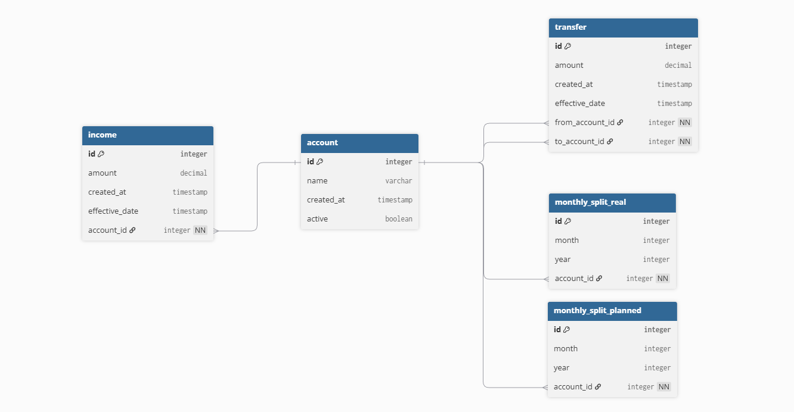

# FinanceApp

FinanceApp helps you track your finances easily.  
It allows you to manage multiple bank accounts, investments, and transfers in one place.

It is usual to own many bank accounts for different purposes: investing, saving up, daily usage... This makes difficult to track the money. To maintain good finances it is useful to have everything tracked in one place. This allows planning ahead and prevents that sense of moving money with no purpose.

# Useful Links
Domain model (UML)
ERD (Entity Relationship Diagram): https://dbdiagram.io/d/6988d001bd82f5fce207a50d



Time Tracker: https://track.toggl.com/timer

# Features

### Main Features

- Configuration
  - TurboRepo monorepo with 2 packages: web and db ✅
  - Next.js for frontend and backend ✅
  - Prisma ORM for database management ✅
  - MariaDB as the database ✅
  - Tailwind CSS for styling 🟨
  - TypeScript for type safety 🟨
  - Setup Docker for containerization 🟨
  - Fix Prisma console not working 🟨

- Create & List
  - Accounts ✅
  - Disabled accounts 🟨
  - Incomes to these accounts ✅
  - Transactions between accounts ✅
  - Monthly Splits across accounts (The splits planned at the beginning of the month) 🟨
  - Investments in different products in these accounts 🟨
- View
  - Account details ✅
  - Current Month ✅
  - Past Months with old account state 🟨
  - Month details (Incomes and splits, individual transactions) 🟨
  - Current amount in each account 🟨
  - Monthly splits, planned and real 🟨
  - Performance of these investments 🟨
- Actions
  - Select account instead of account id when creating transactions and incomes 🟨
  - Enable/Disable account 🟨
  - Edit account details 🟨
- Scheduled job to apply pending incomes and transactions at the end of the day 
  - API endpoint ✅
  - Automate with server cron 🟨

#### Status Legend
🟨 Pending
🔷 Ongoing
✅ Completed

# Setup

### 0. Prerequisites

- Node.js (v20)
- Docker (20.10)
- Turborepo (11.10.0)

### 1. Clone the repository
```bash
git clone https://github.com/ezegonmac/FinanceApp_v2.git
cd FinanceApp_v2
```

### 2. Install dependencies
```
npm install
```

### 3. Configure environment variables
Create a .env file from the existing .env.example.

To configure the web app, create a /apps/web/.env file from the existing /apps/web/.env.example.

To configure your database connection, create a /packages/db/.env from the existing /packages/db/.env.example.

For scheduled jobs, set these values:
- CRON_SECRET: shared secret used by internal job endpoint

### 4. Start the database container
```
npm run db:start
```

### 5. Run Prisma migrations
From /packages/db run
```
npx turbo db:migrate
npx turbo db:generate
or
npx prisma migrate dev
```

### 6. Start development server
From the project root folder (/turborepo) run
```
npx turbo run dev --filter=web
or
npm run dev
```
The application will start in development mode 
```
http://localhost:3000
```

# Connect to database
Confirm that the database container is running
```
docker ps
```
Exec into the container and enter password
```
docker exec -it financeapp_db mariadb -u financeuser -p
```

# Reset the database container
```
npx turbo db:force_reset
```

# Stop the database container
```
npm run db:stop
```

# Run Prisma DB viewer
From packages/db run
```
npx prisma studio
```

# Scheduled job: apply pending month items
The endpoint below processes PENDING incomes and transactions for the current month using Europe/Madrid timezone.
```
POST /api/internal/jobs/apply-pending-transactions
Authorization: Bearer <CRON_SECRET>
```

Example cURL:
```
curl -X POST http://localhost:3000/api/internal/jobs/apply-pending-transactions \
  -H "Authorization: Bearer <CRON_SECRET>"
```

To automate from a server cron (daily near end of day in Europe/Madrid):
```
55 23 * * * curl -X POST http://localhost:3000/api/internal/jobs/apply-pending-transactions -H "Authorization: Bearer <CRON_SECRET>"
```

# Dev workflow

ERD → Prisma schema → Migration → Prisma Client → API → UI

Prisma schema: 
```
packages/db/prisma/schema.prisma
```

Run prisma migration (from packages/db): 
```
npx prisma migrate dev --name <schema_name>
```
or (prefered):
```
npx turbo db:migrate -- --name <schema_name>
```

Generate prisma client:
(from the root folder)
```
npx turbo db:generate
```

## Install new dependencies
From the root folder run
```
npm install <dependency_name> --workspace=<package_name>
```
ie:
```
npm install zod --workspace=apps/web
```

# Screenshots


# Tech Stack
- Frontend: Next.js, Tailwind CSS
- Backend: Next.js, Prisma ORM
- Database: MariaDB
- Monorepo: Turborepo
- Development Tools: TypeScript
