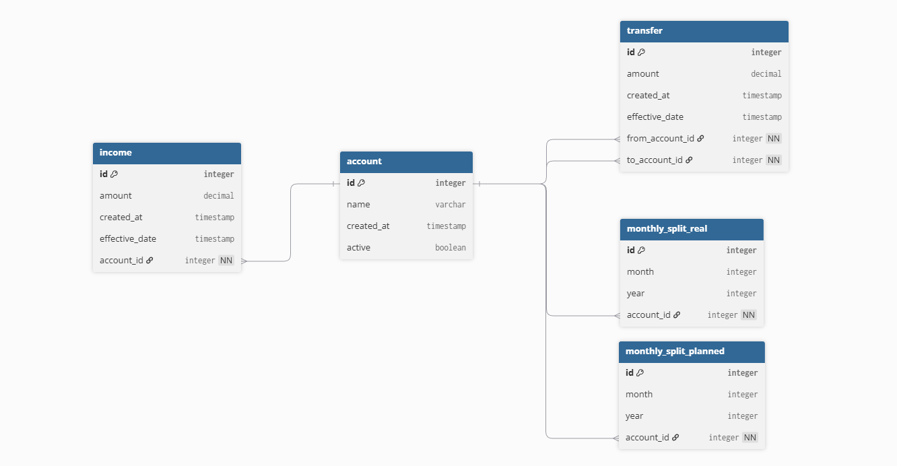

# FinanceApp

FinanceApp helps you track your finances easily.  
It allows you to manage multiple bank accounts, investments, and transfers in one place.

It is usual to own many bank accounts for different purposes: investing, saving up, daily usage... This makes difficult to track the money. To maintain good finances it is useful to have everything tracked in one place. This allows planning ahead and prevents that sense of moving money with no purpose.

# Useful Links
Domain model (UML)
- ERD (Entity Relationship Diagram): https://dbdiagram.io/d/6988d001bd82f5fce207a50d



- Time Tracker: https://track.toggl.com/timer
- Figma: https://www.figma.com/design/woEmmTwFi1JKnyUZOcUek2/FinanceApp-v2?t=WkrJKEab9Lb9dFqG-0
- Stitch (AI design): https://stitch.withgoogle.com/projects/16204193569097462166?pli=1

# Features

This section is the project backlog and single source of truth for feature status.

Features that need further clarification can reference a spec file using `[spec:name]`:

```
- Monthly Splits across accounts 🟨 [spec:monthly-splits]
- Investments in different products 🔷 [spec:investments]
```

Spec files live under `/specs`. See [Spec Workflow](#spec-workflow) for details.

## Main Features

- Configuration
  - TurboRepo monorepo with 2 packages: web and db ✅
  - Next.js for frontend and backend ✅
  - Prisma ORM for database management ✅
  - MariaDB as the database ✅
  - Tailwind CSS for styling (+shadcn/ui) ✅
  - TypeScript for type safety ✅
  - Setup Docker for containerization 🟨
  - Fix Prisma console not working 🟨
  - New package: mobile 🟨
  - New package: shared (for shared types and utils) 🟨
  - New package: api 🟨
- Create & List
  - Accounts ✅
  - Disabled accounts 🟨
  - Incomes to these accounts ✅
  - Expenses from these accounts ✅
  - Recurrent expenses (fixed and variable) ✅
  - Recurrent incomes (start-of-month auto-apply) ✅
  - Recurrent transactions ✅
  - Transactions between accounts ✅
  - Monthly Splits across accounts (The splits planned at the beginning of the month) (recurrent transactions) 🟨
  - Investments in different products in these accounts 🟨
- View
  - Account details ✅
  - Current Month ✅
  - Past Months with old account state ✅
  - Month details (Incomes and splits, individual transactions) ✅
  - Current amount in each account ✅
  - Metrics page with basic data ✅
  - Monthly splits, planned and real 🟨
  - Performance of these investments 🟨
  - Todo tab with pending todo recurrent expenses and recurrent transactions that are not marked as automated (bool attribute) 🟨
  - Sort, filter and search accounts, transactions, incomes and expenses 🟨
  - Sort, filter and paginate incomes, expenses and transactions by month ✅
- Actions
  - Select account instead of account id when creating transactions and incomes ✅
  - Pause and resume recurrent incomes 🟨
  - Pause and resume recurrent expenses 🟨
  - Delete recurrent incomes (with its associated incomes) ✅
  - Delete recurrent expenses (with its associated expenses) ✅
  - Modify recurrent incomes start and end dates 🟨
  - Modify recurrent expenses start and end dates 🟨
  - Modify recurrent transactions start and end dates 🟨
  - Allow recurrent incomes with no end date ✅
  - Allow recurrent expenses with no end date ✅
  - Allow recurrent transactions with no end date ✅
  - Enable/Disable account 🟨
  - Edit account details 🔷
  - Edit income and expense details ✅
  - Edit transaction details ✅
  - Delete individual transactions, incomes and expenses ✅
  - Modify recurrent income, expense and transaction frequency 🟨
- Scheduled job to apply pending incomes, expenses and transactions at the end of the day 
  - API endpoint ✅
  - Automate with server cron 🟨
- I want to be able to differentiate the expense actual value and the one used for expense metrics. "Adjust for analytics" ✅
- The admin can enable and disable the debug mode. In debug mode, there will be additional columns shown in the tables ✅
- Hide the "Adjust for analytics" field if not needed ✅
- Year analytics with the total amount of incomes, expenses and transactions for the year 🟨
- Bugs
  - In the account section, transactions for this account, I can only see the "to" column. I can add the from column too or use two separate tables for incoming and outgoing transactions ✅
  - When I shift + click a row from Accounts table it doesn´t open a new tab 🟨
- Design
  - Allow account icon ✅
  - Prioritize icons and visual cues for better UX 🟨
  - Improve cleanliness and usability of the UI (data-driven application) 🟨
- Infrastructure
  - Deploy prod version 🟨
- Misc
  - Migrate tables to two different components one more data-driven and one more list styled ✅
  - Create development workflow with integrated AI ✅
  - Upload erd dbdocs file and update erd.png 🟨
  - Add native authentification layer with nextjs 🟨
  - Create a covering test suite 🟨

### Status Legend
🟨 Pending
🔷 Ongoing
✅ Completed

# Setup

### 0. Prerequisites

- Node.js (v20)
- Docker (20.10)
- Turborepo (11.10.0)

### 1. Clone the repository
```bash
git clone https://github.com/ezegonmac/FinanceApp_v2.git
cd FinanceApp_v2
```

### 2. Install dependencies
```
npm install
```

### 3. Configure environment variables
Create a .env file from the existing .env.example.

To configure the web app, create a /apps/web/.env file from the existing /apps/web/.env.example.

To configure your database connection, create a /packages/db/.env from the existing /packages/db/.env.example.

For scheduled jobs, set these values:
- CRON_SECRET: shared secret used by internal job endpoint

### 4. Start the database container
```
npm run db:start
```

### 5. Run Prisma migrations
From /packages/db run
```
npx turbo db:migrate
npx turbo db:generate
or
npx prisma migrate dev
```

### 6. Start development server
From the project root folder (/turborepo) run
```
npx turbo run dev --filter=web
or
npm run dev
```
The application will start in development mode 
```
http://localhost:3000
```

# Connect to database
Confirm that the database container is running
```
docker ps
```
Exec into the container and enter password
```
docker exec -it financeapp_db mariadb -u financeuser -p
```

# Reset the database container
```
npx turbo db:force_reset
```

# Stop the database container
```
npm run db:stop
```

# Run Prisma DB viewer
From packages/db run
```
npx prisma studio
```

# Scheduled job: apply pending month items
The endpoint below processes PENDING incomes, expenses and transactions for the current month using Europe/Madrid timezone.
It also applies active recurrent incomes once per month (idempotent run-log by month).
```
POST /api/internal/jobs/apply-pending-transactions
Authorization: Bearer <CRON_SECRET>
```

Snapshot lifecycle:
- Recalculates current month snapshots for all active accounts (live/provisional values)
- Finalizes previous month snapshots (`is_final = true`, `closed_at` set)
- Keeps historical months locked unless data is edited and recalculated

Month snapshots endpoint:
```
GET /api/months/:year/:month/snapshots
```
For the current month, snapshots are refreshed before returning data so metrics are always available.

Example cURL:
```
curl -X POST http://localhost:3000/api/internal/jobs/apply-pending-transactions \
  -H "Authorization: Bearer <CRON_SECRET>"
```

To automate from a server cron (daily near end of day in Europe/Madrid):
```
55 23 * * * curl -X POST http://localhost:3000/api/internal/jobs/apply-pending-transactions -H "Authorization: Bearer <CRON_SECRET>"
```

# Dev workflow

ERD → Prisma schema → Migration → Prisma Client → API → UI

Prisma schema: 
```
packages/db/prisma/schema.prisma
```

Run prisma migration (from packages/db): 
```
npx prisma migrate dev --name <schema_name>
```
or (prefered):
```
npx turbo db:migrate -- --name <schema_name>
```

Generate prisma client:
(from the root folder)
```
npx turbo db:generate
```

## Install new dependencies
From the root folder run
```
npm install <dependency_name> --workspace=<package_name>
```
ie:
```
npm install zod --workspace=apps/web
```

# Spec Workflow

The Features section acts as the project backlog. Spec files are optional — only create one when a feature needs more thought before implementation.

**Convention:** append `[spec:feature-name]` to a backlog entry to link its spec.

```
- Monthly Splits across accounts 🟨 [spec:monthly-splits]
```

**Rules:**
- Specs live under `/specs/<feature-name>.md`.
- Write a spec before starting implementation when the requirements aren't obvious.
- A feature can be marked ✅ once its acceptance criteria are all met.
- Keep specs short. One page is usually enough.

See `/specs/example.md` for the standard structure.

# Screenshots


# Tech Stack
- Frontend: Next.js, Tailwind CSS
- Backend: Next.js, Prisma ORM
- Database: MariaDB
- Monorepo: Turborepo
- Development Tools: TypeScript
